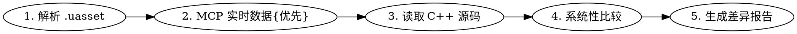

# Blueprint vs C++ 对照验证

## Overview

解析 .uasset → MCP 实时数据（**最强真相源**，可用时优先）→ C++ 源码（辅助参考）→ 系统性比较 → 差异报告。

## 工作流



### Step 1: 解析 .uasset

```bash
python run.py <path-to-asset>.uasset --text 2>&1
```

关注输出中的：
- **组件列表**：名称、类、父类、属性值
- **蓝图属性**：NewVariables、FunctionGraphs、CategorySorting
- **输入绑定**：EnhancedInputAction、InputActionDelegateBindings
- **字节码**：Recovered bytecode 中的函数调用链

### Step 2: MCP 实时数据（**优先**，需要 UE Editor 运行）

**REQUIRED SUB-SKILL:** 使用 `unreal-mcp` skill 的 Blueprint EventGraph Reading 工作流。

关键 MCP 调用：`list_graphs` → `get_graph(EventGraph)` → `find_nodes` → `get_node_infos` → `get_connected_subgraph`。

MCP 数据 = **最终真相源**。解析器输出与 MCP 不一致 → 解析器 bug。

### Step 3: 读取 C++ 源码（辅助参考）

从 Sample 路径推断 C++ 位置（如 `Samples/FirstPersonC/Source/FirstPersonC/FirstPersonCCharacter.{h,cpp}`）。读取 `.h` + `.cpp`，关注：
- **构造函数**：组件创建和初始化参数
- **SetupPlayerInputComponent**：输入绑定关系
- **辅助函数**：DoAim、DoMove、DoJumpStart/End 等

C++ 是蓝图的子集，C++ 与 MCP 不一致 ≠ 解析错误（蓝图编辑器修改）。

### Step 4: 系统性比较

按以下维度逐一对照：

#### 4.1 组件层级

| 对照项 | 解析器 | MCP（真相源） | C++（参考） | 判定 |
|--------|--------|---------------|-------------|------|
| 组件类名 | `ComponentClass` | `get_components` | `CreateDefaultSubobject<T>` | |
| 父组件/挂载 | `AttachParent`/`AttachToName` | `get_components` | `SetupAttachment()` | |
| 属性值 | `FloatProperty`/`BoolProperty` 等 | 节点属性 | 构造函数中的赋值 | |

**判定规则**：解析器 vs MCP 不一致 = 解析错误；解析器 vs C++ 不一致但 MCP 一致 = 蓝图编辑器修改。

#### 4.2 输入绑定

| 对照项 | 解析器 | MCP（真相源） | C++（参考） | 判定 |
|--------|--------|---------------|-------------|------|
| InputAction 名称 | `K2Node_EnhancedInputAction.InputAction` | `find_nodes`/`get_node_infos` | `BindAction(Action, ...)` | |
| 触发事件 | 节点输出引脚 | `get_connected_subgraph` | `ETriggerEvent::Started/Triggered/Completed` | |
| 调用目标函数 | 节点 → 连线 → 函数调用 | 连线追踪 | 函数指针 | |

**判定规则**：C++ 额外的中间层（MoveInput → DoMove）在蓝图中被扁平化是正常的。

#### 4.3 函数逻辑

| 对照项 | 解析器字节码 | MCP（真相源） | C++（参考） | 判定 |
|--------|-------------|---------------|-------------|------|
| 函数名 | `Recovered bytecode for 'X'` | `list_graphs` | 函数定义 | |
| 调用链 | 表达式序列 | `get_connected_subgraph` | 函数体 | |
| 参数 | 函数签名 | pin 连接 | 参数列表 | |

#### 4.4 蓝图独有内容

记录 C++ 中没有的蓝图内容（非错误，但需标注）：
- 触控输入（Primary/Secondary Thumbstick、Touch Jump）
- 蓝图变量（如 Target Touch UI）
- 注释节点（Comment boxes）

### Step 5: 生成差异报告

输出到 `temp/<asset-name>-comparison-report.md`，包含：基本信息、Step 4 的对照表（组件/输入/函数/蓝图独有内容）、差异分类（一致 / 解析错误 / 蓝图编辑器修改 / 蓝图独有）、结论。

## 已验证资产

| 资产 | C++ 对照 | MCP 对照 | 结果 |
|------|----------|----------|------|
| BP_FirstPersonCharacter | FirstPersonCCharacter | — | AirControl 差异（0.6 vs 0.5），其余一致 |

## 注意事项

- **MCP 是最终真相源**：可用时以 MCP 返回的蓝图数据为唯一对照基准，C++ 仅作辅助参考
- C++ 是蓝图子集（缺 Touch、蓝图变量、装饰组件），C++ 与 MCP 不一致 ≠ 解析错误
- 蓝图参数可在编辑器中修改，以 MCP 数据为准（而非 C++ 构造函数）
- `Recovered bytecode` 是扫描恢复的，与原生序列化可能有差异
- MCP 不可用时，退回到以蓝图复制文本为真相源；仅在两者都不可用时参考 C++
