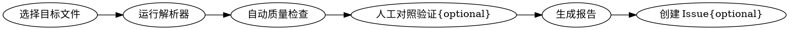

# uasset 解析器输出质量测试

## Overview

对指定 `.uasset` 文件运行解析器，自动检查 JSON/Markdown/C++ 输出的数据完整性和解码正确性，生成带优先级的质量报告。

## 工作流



### Step 1: 选择目标文件

```bash
# 单个文件测试
python scripts/test_output_quality.py path/to/file.uasset

# 指定参考 C++ 对照
python scripts/test_output_quality.py path/to/file.uasset --reference path/to/RefCharacter.cpp

# 仅 JSON 结构检查（快速模式）
python scripts/test_output_quality.py path/to/file.uasset --quick

# 输出到指定目录
python scripts/test_output_quality.py path/to/file.uasset --output-dir temp/
```

### Step 2: 运行解析器

生成三种输出格式供后续验证：

```bash
python run.py file.uasset --json > temp/output.json
python run.py file.uasset --markdown > temp/output.md
python run.py file.uasset --cpp-skeleton > temp/output.cpp
```

### Step 3: 自动质量检查

脚本自动检测以下问题类别：

| 检查项 | 严重度 | 说明 |
|--------|--------|------|
| JSON 有效性 | P0 | 必须是合法 JSON |
| raw_data 泄漏 | P0 | StructProperty 中的 FVector/FRotator 未解码为可读值 |
| transforms 空 | P0 | `blueprint.components[].transforms` 应包含位置/旋转 |
| 函数无名 | P0 | `decompiled_functions[].function_name` 不应为 `"???"` |
| 枚举前缀 | P1 | `UnknownEnum::` 前缀应清洗 |
| MD 缺 Mermaid | P1 | Markdown 应包含组件层级图 |
| MD 缺 IA 绑定表 | P1 | Markdown 应展示 Input Action 绑定关系 |
| name_map 体积 | P2 | name_map 行数占比过高建议移至 --verbose |
| opaque 字段暴露 | P2 | opaque 结构体的 raw_data 不应完整展示 |

### Step 4: 人工对照验证（可选）

当有参考 C++ 代码或蓝图复制文本时：

1. **蓝图复制文本**：从 UE 编辑器复制节点文本，对照验证：
   - 组件属性值（CapsuleHalfHeight、FOV 等）
   - 事件图连线（IA_X → Function）
   - 触控事件覆盖（Primary/Secondary Thumbstick、Jump Start/End）

2. **参考 C++ 代码**：对照验证：
   - 组件声明策略（复用基类 vs 新建）
   - 输入绑定位置（SetupPlayerInputComponent vs BeginPlay）
   - 函数签名（virtual BlueprintCallable 分层）
   - 属性值差异（有意重构 vs 解析错误）

**注意**：参考 C++ 通常是蓝图的简化版（移除触控、合并输入路径、省略资产引用），差异不等于解析错误。以蓝图复制文本为最终真相源。

### Step 5: 生成报告

报告包含：
- 核心发现（按 P0/P1/P2 分级）
- 数据准确性验证（正确项 + 问题项）
- 预期改进效果（量化指标）
- 改进建议（具体修复方向 + 代码示例）

保存为 `temp/<asset-name>-quality-report.md`。

### Step 6: 创建 Issue（可选）

```bash
gh issue create --title "P1: <简述>" --body-file temp/<asset-name>-quality-report.md --label "enhancement,needs-triage"
```

## 常用测试资产

| 资产 | 路径 | 特点 |
|------|------|------|
| 第一人称角色 | `Samples/FirstPerson/Content/FirstPerson/Blueprints/BP_FirstPersonCharacter.uasset` | 双网格体、Enhanced Input、触控、参考 C++ 可用 |
| 第三人称角色 | `Samples/ThirdPerson/Content/ThirdPerson/Blueprints/ThirdPersonCharacter.uasset` | 标准 Character、相机跟随 |
| 游戏模式 | `Samples/FirstPerson/Content/FirstPerson/Blueprints/BP_FirstPersonGameMode.uasset` | 简单蓝图、少组件 |

样本根目录：`E:\Develop\lib\Samples`

## 脚本参考

详细用法：`python scripts/test_output_quality.py --help`

检查项定义见脚本顶部 `CHECKS` 常量，可扩展新检查规则。
